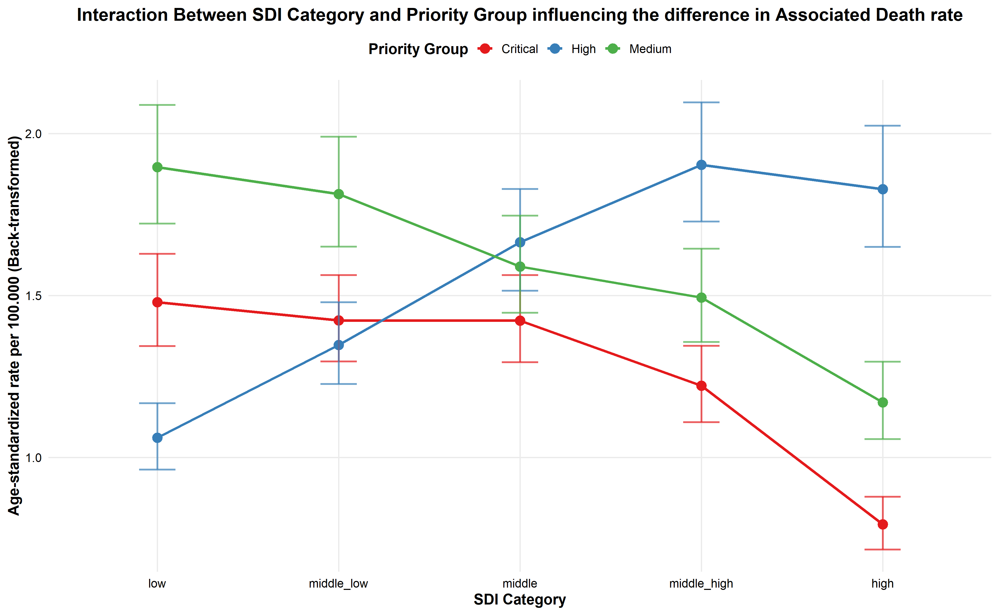

# Antimicrobial Resistance Burden Analysis using WHO Priority Pathogens and Global Burden of Disease Data

## Project Overview

Antimicrobial resistance (AMR) is one of the most pressing global public health challenges. To guide research, surveillance, and policy actions, the World Health Organization (WHO) released the Bacterial Priority Pathogens List (BPPL), identifying antibiotic-resistant bacteria of highest concern.

The latest WHO report refines the prioritization of antibiotic-resistant bacterial pathogens and categorizes them into three groups:

- *Critical priority* - ex. Acinetobacter baumannii, carbapenem-resistant  
- *High priority* - ex. Staphylococcus aureus, methicillin-resistant  
- *Medium priority* - ex. Streptococcus pneumoniae, macrolide-resistant  

These categories help guide research and development (R&D) of new antibiotics and inform public health interventions.

This project combines the WHO BPPL framework with disease burden data from the Global Burden of Disease (GBD) microbial database to analyze how antimicrobial resistance burden varies across countries and development levels.

Metrics such as *mortality* and *Disability-Adjusted Life Years (DALYs)* are used to evaluate the burden associated with antimicrobial resistance.  

**DALYs** were used to measure pertussis burden because they capture *both premature death and illness in one metric.* They combine **years of life lost from early mortality (YLLs)** with **years lived with disability (YLDs)**, giving a fuller picture of health loss than incidence or mortality alone.

WHO report and GBD data reference:  
https://www.who.int/publications/i/item/9789240093461  
https://vizhub.healthdata.org/microbe/

---

### Data Extraction

A total of *25 burden estimates* (mortality and Disability-Adjusted Life Years, DALYs) for **bug–drug combinations** were extracted from *204 countries and territories*.

The data were obtained from the *Global Burden of Disease (GBD)* database and covered the period *1990–2021*.

Age-specific data were extracted for all age groups, ranging from:

- *0–4 years*
- *5–9 years*
- continuing in 5-year intervals
- up to *95+ years*

These data were used for the subsequent analysis.

---

## Key Concepts

### Attributable vs Associated Burden

The GBD antimicrobial resistance dataset provides two types of burden estimates.

- *Attributable burden* - represents the number of deaths or DALYs *caused directly by antibiotic resistance*, the portion of disease burden that would not occur if antibiotics were still effective.

- *Associated burden* - represents the number of death or DALYs *linked to infection involving resistant bacteria*, whether or not resistance was the main cause of the outcome.

### Socio-Demographic Index (SDI)

The *socio-demographic index* is a composite indicator used in the GBD study to measure a country's level of development. SDI is based on three components: income per capita, educational attainment and fertility rate in individuals younger than 25 years.  

Countries are classified into five SDI groups, enables comparision of disease burden across countries with different development levels:

1. *Low SDI* - ex. Niger and Chad
2. *Low-middle SDI* - ex. Laos and India
3. *Middle SDI* - ex. Brazil and Egypt
4. *High-middle SDI* - ex. China and Hungary
5. *High SDI* - ex. United States of America and Germany

Socio-demographic index reference:  
https://ghdx.healthdata.org/record/gbd-2023-socio-demographic-index-sdi  

---

## Research Questions  

According to the data we have what kind of question can we ask from them?  

### 1. How does AMR burden vary across countries and development levels?  

- How do the burdens of *critical, high, and medium priority pathogens* differ between countries?
- How does the burden vary across *SDI groups*?


### 2. How has the burden of AMR changed over time?  

- Has the burden increased or decreased over time?
- Are there *significant turning points in the trend*?

### 3. How might AMR burden change in the future?

- What is the *projected trend of AMR burden over the next 10 years*?

---

## Data Preparation

### Aggregating WHO Priority Pathogen Groups

Pathogen-specific burden estimates from the GBD microbial dataset were grouped according to the WHO Bacterial Priority Pathogens List (BPPL) into: ***critical, high, and medium***.

For each country, year and age-group, group-specific burden metrics were calculated, including:

- Attributable death rate
- Associated death rate
- Attributable DALY rate
- Associated DALY rate

### Age Standardization

Comparisons across countries can be *misleading* because population age structures differ. To make rates comparable, age-standardized rates (ASR) were calculated using the **WHO World Standard Population**.

The WHO World Standard Population is a reference age distribution used to adjust for differences in age structure between populations.

Reference:  
https://seer.cancer.gov/stdpopulations/world.who.html  

### SDI Categories  

Each country has a different SDI value for each year, reflecting its level of development. To enable comparisons across development levels, countries were classified into five SDI categories and merged with the main dataset for subsequent analysis.  


### Overview of Final Transformed Data  

| Location     | Year | Metric              | Priority Group | ASR | SDI Value  | SDI Category |
|--------------|------|---------------------|----------------|-----|------------|--------------|
| Afghanistan  | 1990 | Attributable_Deaths | Critical       | ... | 0.18021503 | Low          |
| Afghanistan  | 1990 | Attributable_Deaths | High           | ... | 0.18021503 | Low          |
| Afghanistan  | 1990 | Attributable_Deaths | Medium         | ... | 0.18021503 | Low          |

---

## Data Analysis
### Approach and Assumption check

The aim of this analysis was to investigate:
- how two categorical variables - *BPPL* and *SDI* influence the *burden rate*. Conceptually, this is similar to a two-way ANOVA, where the effects of two categorical variables on a continuous outcome are evaluated.

However, the dataset contains:
-  extreme values across countries, which violates the assumption of normally distributed residuals required for a classical ANOVA.
-  observations are not fully independent because each country appears repeatedly across multiple years (1990–2021). These repeated measurements introduce correlation within countries.

To address these issues, a *mixed-effects linear model* was used 
- This approach is better suited to longitudinal data because it accounts for the fact that the same country is observed multiple times and allows each country to have its own underlying baseline burden level.


Data transformation

- Because the burden rate showed extreme values, the outcome variable was ***log-transformed*** before fitting the model. This improved the distribution of the residuals and provided a better overall model fit.

<details>
  <summary>Click to check model assumptions</summary>
  
    

  - **Normality of residuals** - we checked whether the residuals were approximately normally distributed 
  - **Homogeneity of variance** - we evaluated whether the residuals had constant variance across fitted values, reference line should be flat or horizontal
  - **High VIF** values were observed, likely reflecting **structural multicollinearity** caused by the repeated SDI classification within country-year observations across priority groups and the inclusion of interaction terms. This may reduce the stability of individual coefficient estimates, but it is less problematic for the main objective of the study, which was to **compare adjusted group means using estimated marginal means and contrasts**. Therefore, the interaction term was retained because testing differences between SDI categories and priority groups was a central aim of the analysis
  - After a log transformation on the data, we can see clearly the improvement of model assumption
</details>


### Interaction between BPPL and SDI
#### Fitting mixed linear model in R
```r
model_log <- lmer (
  log_ASR ~ sdi_cat * priority_group + Year + (1 | Location),
  data = df_assdrate)
```
This model can be written as:

```
log_ASR_ltp = b0 + b1 * SDIgroup_lt + b2 * BPPL + b3 * (SDIgroup_lt × BPPL_p) + b4 * Year_t + u_l + e_ltp
```
Where:

- *l* –  location
- *t* – year
- *p* – priority group
- *b0* – the intercept
- *b1* – the effect of SDI category
- *b2* – the effect of priority group
- *b3* – the interaction effect between SDI category and priority group
- *b4* – the effect of calendar year
- *u_l* – the random intercept for location
- *e_ltp* – the residual error

#### Interaction between BPPL and SDI (SDI group x BPPL)

An important part of the analysis was to test whether **BPPL and SDI interact**.

This means asking whether the effect of one variable depends on the level of the other. For example, the difference in burden between priority groups may not be the same across different SDI groups.

For example, **the gap between critical and medium priority burden might be large in low-SDI settings but smaller in high-SDI settings.**  

The interaction was found to be *statistically significant*, which means that BPPL and SDI should be interpreted **together rather than separately**.

## Interpretation of results

To help interpret the interaction, *estimated marginal means* were calculated from the fitted model. These represent the model-based average burden rates for each BPPL–SDI group after accounting for the structure of the data.

Pairwise comparisons were then used to compare groups with each other.

<details>
  <summary>Click to see the explaination on how to use exponentiation to back transform log scale measure for interpretation</summary>

  Because the model was fitted on the *log scale*, the estimated differences were later **back-transformed** to the original scale using the exponential function. This makes the results easier to interpret in practical terms.  
  
  **Estimated marginal means** are **model-based** estimates of the average outcome in each group, *adjusted for the other variables* included in the model:   
  - Comparisons between groups are based on contrasts of these estimated means   
  - For example, if the estimated burden rate is **5 per 100,000** in the **low-SDI** group and **2 per 100,000** in the **high-SDI** group, the **difference is 3 per 100,000**, indicating a higher burden in the low-SDI group.
  
  When the model is fitted on the log scale, group comparisons are first estimated on the log scale and then back-transformed to the original scale for interpretation. 
  
  - In this setting, differences on the log scale correspond to ratios on the original scale, because log(A) - log(B) = log(A/B).  
  - Therefore, a back-transformed estimate of 1.4 indicates that the burden rate in one group is 1.4 times higher than the other comparison group, or 40% higher.

 

</details>  
<br><br>

The back-transformed estimated marginal means of **associated death rates** (per 100,000) in the **High priority group** were 1.06 (low SDI), 1.35 (middle-low), 1.66 (middle), 1.90 (middle-high), and 1.83 (high SDI). Pairwise comparisons indicated that differences between SDI categories were statistically significant, except between the middle and high SDI groups.

*Table1. Back transformed modeled estimated mean of associated death rate from AMR caused by High priority group*  
| SDI Category   | Priority Group | Log-Scale EMM (95% CI)       | Back-Transformed EMM (95% CI) |
|----------------|----------------|-------------------------------|-------------------------------|
| Low            | High           | 0.058 (-0.038 – 0.155)       | 1.06 (0.96 – 1.17)           |
| Middle-Low     | High           | 0.298 (0.205 – 0.392)        | 1.35 (1.23 – 1.48)           |
| Middle         | High           | 0.509 (0.415 – 0.604)        | 1.66 (1.51 – 1.83)           |
| Middle-High    | High           | 0.644 (0.547 – 0.740)        | 1.90 (1.73 – 2.10)           |
| High           | High           | 0.603 (0.501 – 0.705)        | 1.83 (1.65 – 2.02)     


<br>



*Figure1. Estimated Marginal Means of associated death rate across SDI levels*

<br>

In terms of relative differences, the attributable rate in low SDI countries was 42% lower than in high SDI countries (ratio = 0.58, 95% CI: 0.53–0.64), and 44% lower than in middle-high SDI countries (ratio = 0.56, 95% CI: 0.52–0.60) etc... These groups' difference significance except between middle high and high SDI groups.

*Table2. SDI group comparision on the log transformed scale associated death rate* 
| Pairwise Comparision     | Estimate (95% CI)      | Back-Transformed (95% CI) | p-value |
|--------------------------|-----------------------|---------------------------|---------|
| low - middle_low         | -0.24 (-0.29 – -0.19) | 0.79 (0.75 – 0.83)       | <0.05  |
| low - middle             | -0.45 (-0.52 – -0.39) | 0.64 (0.60 – 0.68)       | <0.05  |
| low - middle_high        | -0.59 (-0.66 – -0.51) | 0.56 (0.52 – 0.60)       | <0.05  |
| low - high               | -0.55 (-0.64 – -0.45) | 0.58 (0.53 – 0.64)       | <0.05  |
| middle_low - middle      | -0.21 (-0.26 – -0.16) | 0.81 (0.77 – 0.85)       | <0.05  |
| middle_low - middle_high | -0.35 (-0.41 – -0.29) | 0.71 (0.67 – 0.75)       | <0.05  |
| middle_low - high        | -0.31 (-0.39 – -0.22) | 0.74 (0.68 – 0.80)       | <0.05  |
| middle - middle_high     | -0.13 (-0.18 – -0.08) | 0.87 (0.83 – 0.92)       | <0.05  |
| middle - high            | -0.09 (-0.16 – -0.02) | 0.91 (0.85 – 0.98)       | <0.05  |
| middle_high - high       | 0.04 (-0.02 – 0.10)   | 1.04 (0.98 – 1.10)       | Not sig |

The estimated marginal means (EMMs) derived from the mixed-effects model differ from the raw group means shown in the boxplots, which is expected given the model structure. While the boxplots represent unadjusted distributions of observed log-transformed death rates across SDI categories, the EMMs reflect model-based estimates that adjust for covariates, including year, and account for clustering at the country level through random effects. As a result, the EMMs represent population-average effects under a balanced design rather than simple averages. 

The relatively low marginal R² (0.076) compared to the conditional R² (0.771) indicates that most of the variability is explained by between-country differences captured by the random effects, rather than by the fixed effects alone. Together, these factors explain why the estimated marginal means do not align exactly with the values observed in the raw data.


*Figure 2. Box plot showing the distribution of the observed data with raw means (log-scale) for each group, superimposed with the model-estimated means (log-scale)*

<br>

## Conclusion
These results highlight that there are substantial differences in antimicrobial resistance related death rates across countries, beyond what can be explained by SDI category or priority group alone. The strong contribution of country-level random effects suggests that local factors, such as health system capacity, infection control and antibiotic stewardship policies, and the quality of surveillance, play a major role in shaping outcomes. This implies that even countries with similar socioeconomic development may experience very different burdens, underscoring the importance of targeted, context-specific interventions. Public health strategies should therefore not only consider broad global patterns but also focus on strengthening national and subnational policies, improving access to effective treatments, and enhancing local antimicrobial stewardship programs to reduce preventable deaths.
